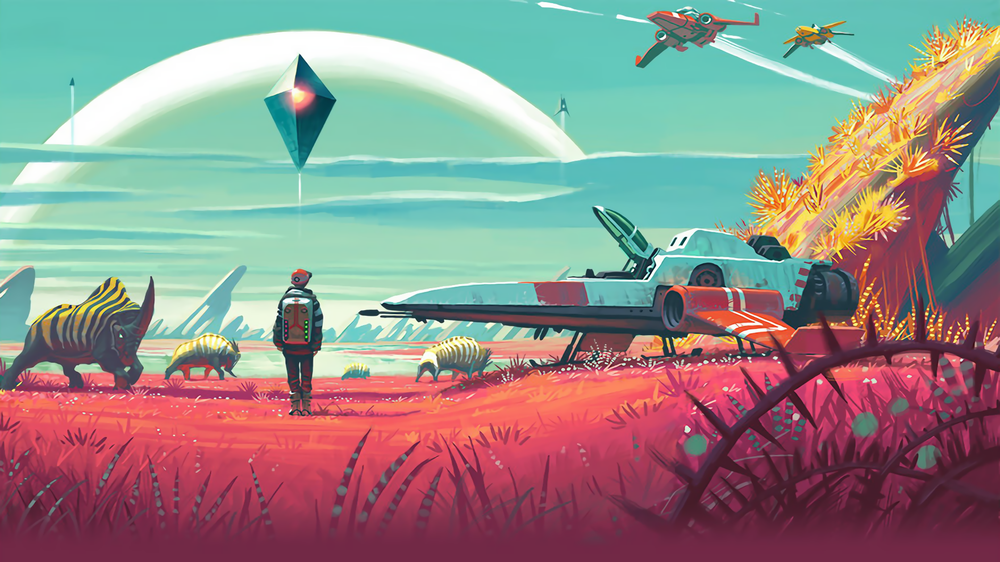

  
  

## 
Hi 👋 I'm Jay! A Computer Science 👨‍💻 student from Adamson University 🇵🇭
  

#### 
 I aspire to be a Software Engineer 🚀
  
  

- 🔭 I’m currently working on [JAMMA](https://github.com/lonewanderer27/JAMMA), an E-Commerce web app that runs as a Python Flask serverless app in Vercel.
  

- 🌱 I’m currently learning C# and Java in Uni, while I learn Python, JavaScript and PHP in my free time. 
  

- 👨‍💻 All of my projects are available at [https://lonewanderer27.github.io/projects](https://lonewanderer27.github.io/projects)  
  

- 📝 I write articles on [https://lonewanderer27.github.io/blog](https://lonewanderer27.github.io/blog)  
  

- ❓ Ask me about anything programming related and the latest video games!  
  

- ⚡ Fun fact: I use tabs over spaces and my comfort food is Fried Chicken  
  

- 📒 Know about my experiences https://lonewanderer27.github.io/cv  [Might be outdated]
  

   

## My Skill Set  
<table><tr><td valign="top" width="33%">

### Frontend  

  
  
  
  
  
  
  
  

</td><td valign="top" width="33%">

### Backend  

  
  
  
  
  
  
  
  
  
  

</td><td valign="top" width="33%">

### Others  

  
  
  
  
  
  
  
  
  

</td></tr></table>  

   

## Connect with me  

  

  
  

   

## Github Stats  

  

  

   

## Recent Blog Posts  
<!-- BLOG-POST-LIST:START -->
- [Reply to Should Old Friends and Days of Long Ago Should Be Forgotten?](http://localhost:4000/blog/reply-to-should-old-friends-and-days-of-long-ago-should-be-forgotten/)
- [Making Camp Buddy Toolbox using PySimpleGUI](http://localhost:4000/blog/making-camp-buddy-toolbox-using-pysimplegui/)
- [My Coming Out Story](http://localhost:4000/blog/my-coming-out-story/)
- [I&#39;m Gay. Nerd.](http://localhost:4000/blog/im-gay-nerd/)
- [Introducing The Coffee Lounge™](http://localhost:4000/blog/the-coffee-lounge/)
<!-- BLOG-POST-LIST:END -->  

   

  

   

  
  

   

 

----

Generated using <a href="https://profilinator.rishav.dev/" target="_blank">Github Profilinator</a>

